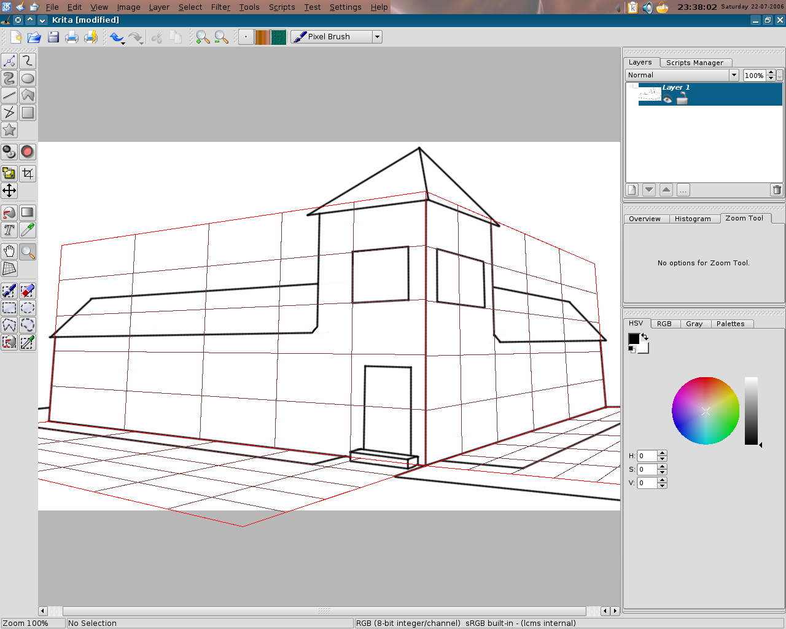
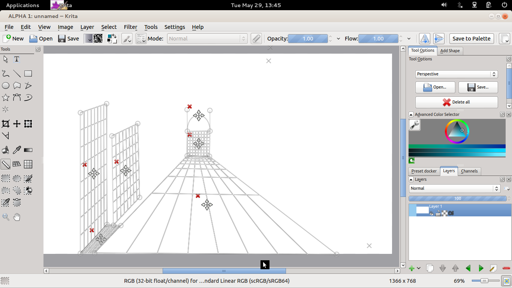
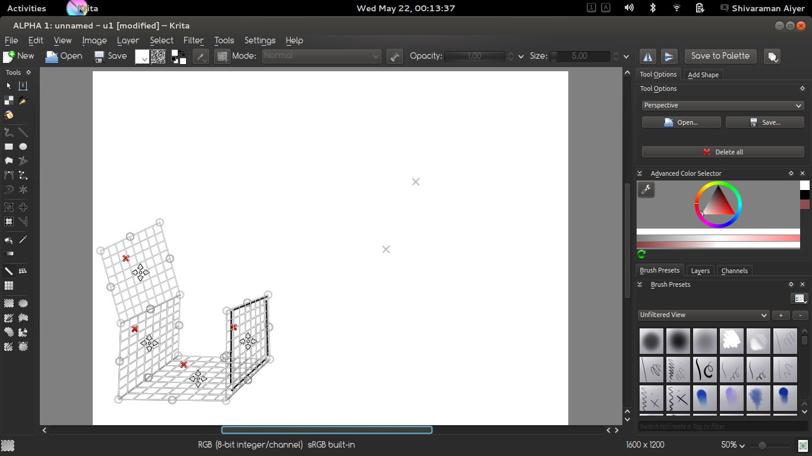

Been quiet some time since my last blog about [Krita](https://www.krita.org), as I had been a bit busy with college work. Nonetheless, with whatever time I had, and all the help from Boud, I have been able to import a particular feature from the Perspective Grid to the Perspective Assistant.

## _Perspective Grid_

The Perspective Grid(here on referred to as Grid, sounds very formal :-P) is a grid for which all “parallel” lines intersect on a vanishing point. This helps the artist to create 3D effect on a 2D canvas, for example buildings or roads going upto the horizon.

Images are taken from [Cyrille Berger's blog](http://blog.cberger.net/2006/07/22/perspective-grid/) about Perspective Grid

The grid acts as a guide for the artist to draw parallel lines on the canvas, using line tool or similar straight line tool.

## _Perspective Assistant_

The Perspective Assistant(here on referred to as Assistant, still feels the same :-) ) is similar in looks to the Grid but unlike the Grid, with Assistant an artist can draw straight lines using the freehand tool too. This is achieved by checking the assistant checkbox after selecting the freehand tool.

On checking the "assistant" checkbox, the user can just draw on the grid and the assistant will itself draw the straight line with respect to the grid created.

## _I understood the working of both the Grid and the Assistant, but, what is the feature that is being talked about?_

Well, that is easy to describe, the second figure above shows the side handles, in the middle of each side of the grid, these side handles can be dragged in the same way as the side handles to create new grids which extend the existing grid.

## _Why add a feature that already exists on one tool to another?_

That is something one might ask, when he/she sees the grid and the assistant for the first time. But, on using them, one comes to know few points of important differences.

First of all, the Grids cannot be moved. Once created a Grid stays where it is till it is deleted. Secondly, new Grids cannot be created by themselves. A new grid can only be extended from an existing grid and stays that way till the end. Third and the last one that comes to my mind is that the handles in a Grid are fixed in reference, i.e. the handle which is on the top left corner can never be taken to a different location.

But in the Assistant all of this can be done, an Assistant can be moved, new assistants can be created out of the blue, the handles can change their locations, creating new shape of the grid with that change.

I am not saying that the Grid is a drawback. It was created with a different purpose and been here since a long time. But, the Assistant is just the upgrade on the base idea of the Grid.

## _What now?_

What else? The Assistant now has these side handles and works really fine :D.

Although, now that I think of I should include technical details! I guess I will, but not now.

To all the artists, please use the new feature and give us your feedbacks wherever you want. My IRC nick is sraman on #krita, email id is [sra392@gmail.com](mailto:sra392@gmail.com) or even here. Awaiting eagerly :-).
